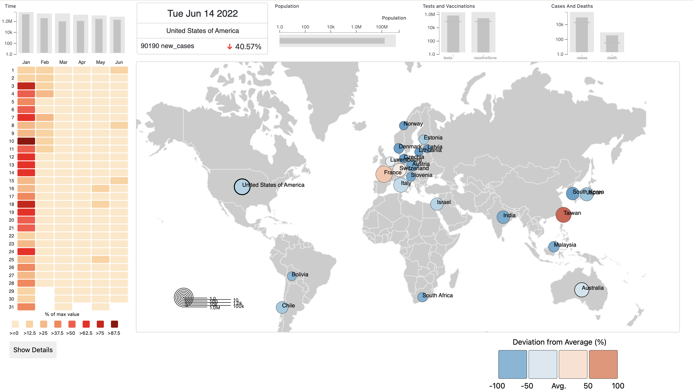

#COVID-19 CASES Around the Word Dashboard

##This project utilizes the D3.js library and JavaScript to create an interactive dashboard for visualizing COVID-19 cases globally. The dashboard, adapted from the original BubbleNet system designed for cybersecurity data visualization, provides a comprehensive way to analyze patterns in COVID-19 outbreaks. It features a geolocation-based map, temporal heat maps, and bullet charts to represent key data attributes such as new cases, deaths, vaccinations, and tests. Users can explore trends, deviations, and relationships in the data through interactive and scalable visualizations, enabling insights into geographical and temporal patterns to inform decision-making.